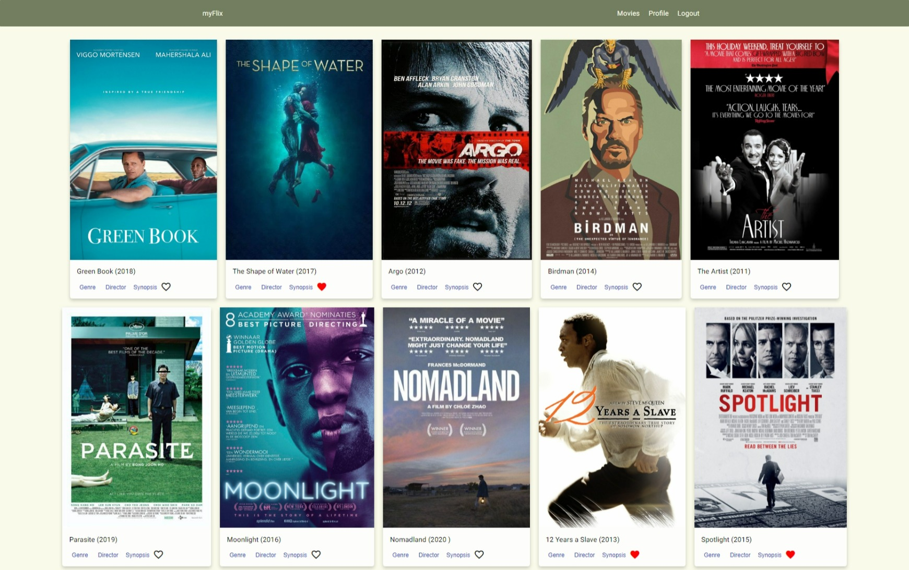

# OscarFlicks - Angular App

> Welcome to OscarFlicks, a minimal client-side single page application (SPA) that allows users to browse Academy Award winning films. The app is built on top of existing server-side code, including a REST API and database.

Live Demo: https://minhajislam674.github.io/myflix-angular/

Repository for server-side code: https://github.com/minhajislam674/movie-api

## Features

With OscarFlicks, you can easily search and filter through a wide range of Academy Award winning films, view detailed information about each film, and even sign up to be able to add films to your watchlist.

## Built with

- Angular
- TypeScript
- Angular-Material
- TypeDoc

## Getting Started

1. Clone the project
2. Install Angular CLI
3. Run `ng serve` for a dev server.
4. Navigate to `http://localhost:4200/`

## Contributing

1. Fork the Project
2. Create your Feature Branch (git checkout -b feature/AmazingFeature)
3. Commit your Changes (git commit -m 'Add some AmazingFeature')
4. Push to the Branch (git push origin feature/AmazingFeature)
5. Open a Pull Request
